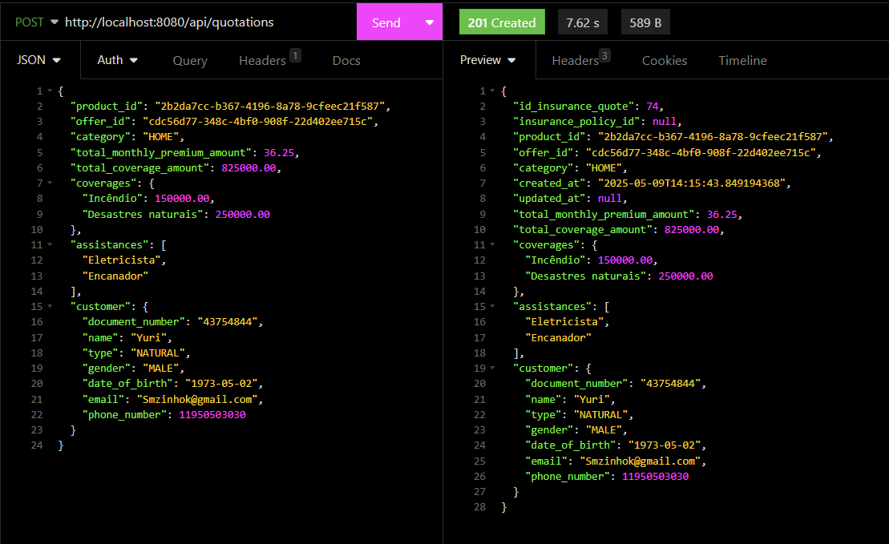
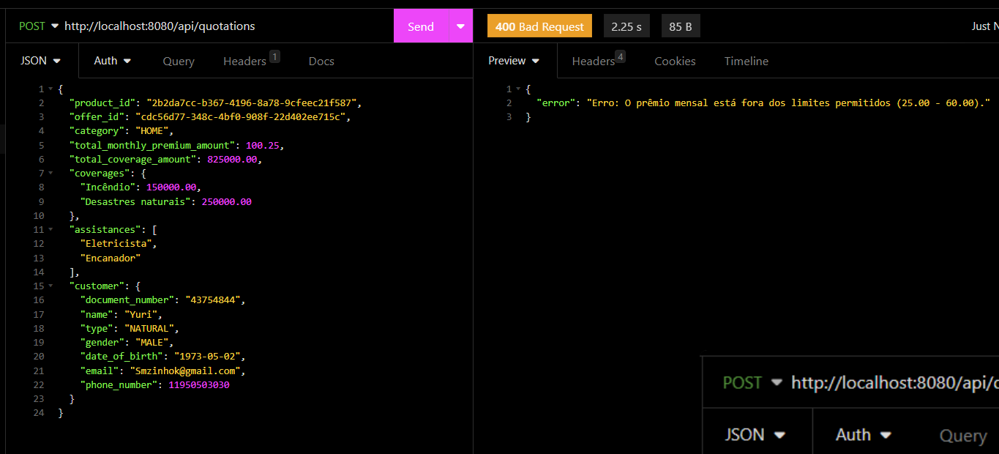
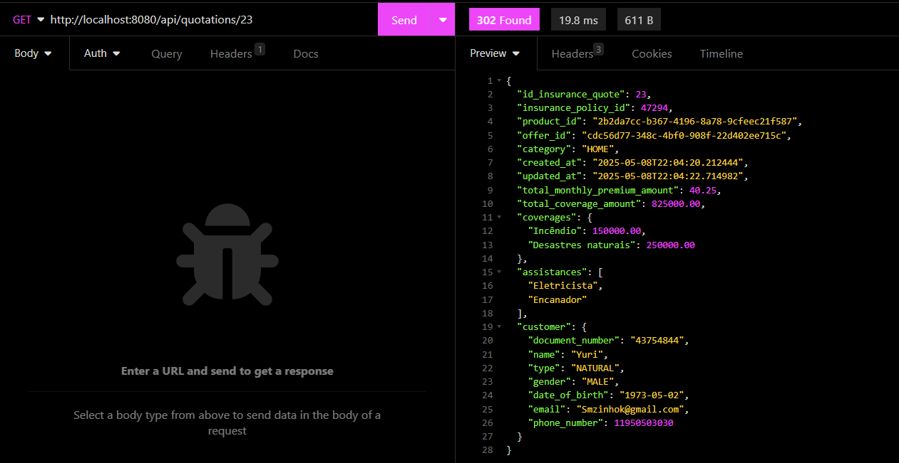

# 🚀 Desafio - Software Engineer | Seguradora ACME

Este repositório contém a solução para o desafio técnico proposto pela seguradora ACME, com foco na criação de uma API REST responsável pelo processamento de cotações de seguros, validação de produtos e ofertas, e integração com mensageria para emissão de apólices.


## 🧰 Tecnologias Utilizadas

- Java 11 / 17
- Spring Boot
- Docker & Docker Compose
- RabbitMQ
- Insomnia
- WireMock
- Grafana
- Phometheus
- Banco de Dados: PostgreSQL
## 🔍 Funcionalidades

✅ Recebimento de cotações de seguros via POST

✅ Validação de produtos e ofertas consultando serviço de catálogo (simulado via mock)

✅ Validação de coberturas, assistências e prêmios conforme oferta

✅ Persistência da cotação válida no banco de dados

✅ Publicação de mensagem em broker para apólice ser emitida

✅ Atualização posterior da cotação com ID da apólice emitida

✅ Consulta de cotações via GET
## 📄 Exemplos de Endpoints

**POST /api/quotations** — Criar uma nova cotação

**POST /api/policy** — Gera apólicies

**GET /api/quotations/{id}** — Consultar cotação por ID


## Documentação da API

#### Realiza a criação da cotação de seguro e valida dados

```http
  POST /api/quotations
```

| Parâmetro   | Tipo       | Descrição                            |
| :---------- | :--------- | :----------------------------------  |
| `Content-Type` | `string` | Tipo do retorno da api |
| `body` | `Json` | Json com os dados da cotação de seguro solicitada |


#### Realiza a criação da apólices de seguro

```http
  POST /api/policy
```

| Parâmetro   | Tipo       | Descrição                            |
| :---------- | :--------- | :----------------------------------  |
| `Content-Type` | `string` | Tipo do retorno da api              |
| `body` | `Json` | Json com os dados da cotação para geração de apólice |


#### Retorna a cotação criada

```http
  GET /api/items/{id}
```

| Parâmetro   | Tipo       | Descrição                                   |
| :---------- | :--------- | :------------------------------------------ |
| `id`      | `int` |  Id da cotação de seguro gerado    |

| Parâmetro   | Tipo       | Descrição                                    |
| :---------- | :--------- | :------------------------------------------- |
| `Content-Type` | `string` | Tipo do retorno da api     |


**OBS**: As colletions estão disponível na pasta do projeto


## 🔁 Integrações

📦 Serviço de Catálogo (mockado):

Validamos produtos e ofertas existentes/ativos via mocks estáticos.

**Exemplos de Endpoints Mockados**

**GET /api/v1/product/{guid_product}** — Consulta dados dos produtos do seguro

**GET /api/v1/offer/{guid_offer}** — Consultar consulta as ofertas do produto do seguro


**📬 Mensageria:**

Kafka / [ ] RabbitMQ / [x] 

Fila no RabbitMQ: policy-issued


## ## 📦 Como Rodar o Projeto

Clone o projeto ou descompacte o projeto

```bash
  git clone https://github.com/yurimoyses09/Servi-o-de-cota-o-de-Seguros/tree/main
```

Entre no diretório do projeto

```bash
  cd insurence-acme-api
```

Execute o comando para iniciar o docker

```bash
  docker-compose up --build
```

Validar se imagens subiram no container docker

```bash
  docker ps
```

Vale salientar que é necessario ter instalado o Docker no meu computador. Para verificar se você possui o docker na maquina, basta rodar o seguinte comando:

**docker --version**

Retonando algo semelhante a isso...

**Docker version 26.1.4, build...** 

Está tudo OK :)

**Link para instalação: https://docs.docker.com/desktop/setup/install/windows-install/**


## Demonstração

Ao validar que o serviço está funcionando no container docker, podemos seguir para o funcionamento em si. A seguir tera uma breve demonstração de como funciona o serviço.


1. Enviar os dados via Insonmia para a api:



Se os dados estiveram validos tera um retorno de status code 201 e os dados gravados na base.
Em caso de erro algo semelhante irá retornar:




2. Ao ser enviado a cotação ira gerar um evento no RabbitMQ para a geração de apólices (links estarão no fim da documentação). Para validar a geração de apólice podemos chamar a api /api/items/{id_cotacao}:



No retorno ira ter os campos "insurance_policy_id" que é a apólice gerada.

## Links dos serviços

📄 Grafana: http://localhost:3000/


📄 Prometheus: http://localhost:9090/targets 


📄 RabbitMQ: http://localhost:15672/


**OBS**: Senhas estão no arquivo docker-compose.yml


## Autores

- [@yurimoyses09](https://github.com/yurimoyses09)
